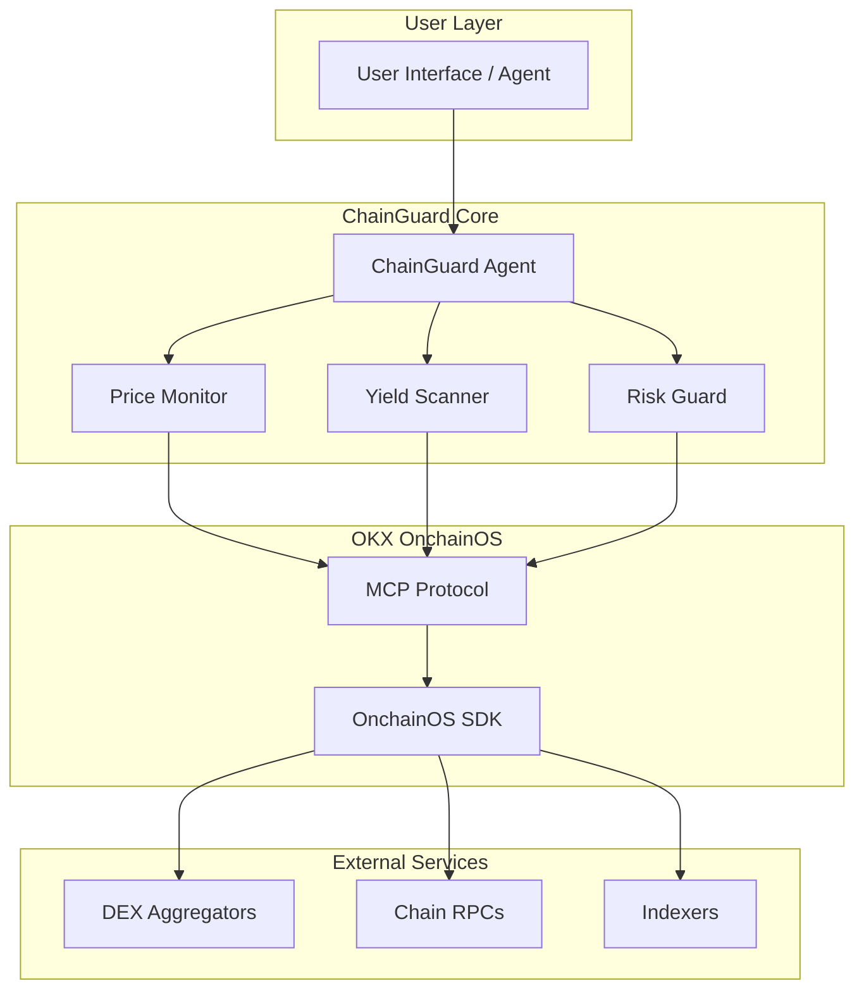

# ChainGuard

🏆 **Built for OKX Build X Hackathon 2026**


[](https://opensource.org/licenses/MIT)
[

> On-chain Asset Protection AI Agent Skill for OKX OnchainOS
> Real-time price monitoring, yield optimization, and risk management for multi-chain DeFi portfolios

## 🎯 Overview

ChainGuard is an AI Agent Skill built for the OKX OnchainOS platform that provides comprehensive on-chain asset protection through three core capabilities.

> 📢 **This project is submitted to both X Layer Arena and Skills Arena tracks.**

- **Price Monitor** - Real-time price tracking with customizable alerts
- **Yield Scanner** - Multi-chain DeFi opportunity discovery
- **Risk Guard** - Portfolio risk analysis and protection

## ✨ Features

### 🚀 Price Monitoring
- Real-time price tracking for ETH, BTC, SOL, and 60+ chains
- Customizable drop thresholds (default: 10%)
- Multi-channel alerts (Telegram, Email, Webhook)
- Price history analysis

### 💰 Yield Scanning
- Scan 500+ DEX protocols across 5 major chains
- APY rankings with risk assessment
- Optimal allocation calculator
- Auto-compound opportunity detection

### 🛡️ Risk Management
- Portfolio risk scoring (0-100)
- Concentration, volatility, and exposure analysis
- Rug pull detection
- Protection scenario simulation
- Agentic Wallet integration for automated protection

## 🏗️ Architecture



## 🔗 Supported Chains

| Chain | Native Token | Explorer | Status |
|-------|-------------|----------|--------|
|  | ETH | [Etherscan](https://etherscan.io) | ✅ Active |
|  | SOL | [Solscan](https://solscan.io) | ✅ Active |
|  | ETH | [Basescan](https://basescan.org) | ✅ Active |
|  | BNB | [BscScan](https://bscscan.com) | ✅ Active |
|  | OKB | [OKLink](https://www.oklink.com/oktc) | ✅ Active |

## 📦 Installation

### Prerequisites
- Node.js >= 18.0.0
- npm or yarn
- OKX OnchainOS API Key (optional for demo)

### Quick Start

```bash
# Clone the repository
git clone https://github.com/hzjdhksjdh790-ux/chainguard.git
cd chainguard

# Install dependencies
npm install

# Run the demo
npm start
```

### Environment Variables

Create a `.env` file in the root directory:

```env
# OKX OnchainOS API
ONCHAINOS_API_KEY=your_api_key_here

# Optional: Custom RPC endpoints
ETHEREUM_RPC=https://your-eth-rpc.com
SOLANA_RPC=https://your-solana-rpc.com

# Alert Channels (optional)
TELEGRAM_BOT_TOKEN=your_telegram_token
TELEGRAM_CHAT_ID=your_chat_id
```

## 🚀 Quick Usage

### As an ES Module

```javascript
import { ChainGuard } from './src/index.js';

// Initialize ChainGuard
const guard = await ChainGuard.initialize({
  alerts: { priceDropThreshold: 15 }
});

// Run a full portfolio audit
const report = await guard.execute('full_audit', {
  walletAddress: '0x123...',
  chains: ['ethereum', 'solana', 'base']
});

console.log(report.summary);
```

### Price Monitoring

```javascript
import { priceMonitor } from './src/skills/priceMonitor.js';

// Check prices with alerts
const report = await priceMonitor.checkPrices({
  assets: ['ETH', 'BTC', 'SOL'],
  dropThreshold: 10
});

// Start continuous monitoring
const stop = priceMonitor.startMonitoring({
  assets: ['ETH', 'BTC'],
  dropThreshold: 5,
  onAlert: (report) => {
    console.log('ALERT:', report.alerts);
  }
});

// Stop after 1 hour
setTimeout(stop, 3600000);
```

### Yield Scanning

```javascript
import { yieldScanner } from './src/skills/yieldScanner.js';

// Scan for yield opportunities
const report = await yieldScanner.scan({
  chains: ['ethereum', 'solana', 'base'],
  minAPY: 8,
  maxRisk: 'MEDIUM',
  limit: 20
});

// Get best yield for USDC
const bestYield = await yieldScanner.findBestYield('USDC');

// Calculate optimal allocation
const allocation = await yieldScanner.calculateOptimalAllocation({
  totalAmount: 10000,
  assets: ['USDC', 'ETH'],
  riskTolerance: 'LOW'
});
```

### Risk Analysis

```javascript
import { riskGuard } from './src/skills/riskGuard.js';

// Analyze wallet portfolio
const report = await riskGuard.analyze({
  walletAddress: '0x742d35Cc6634C0532925a3b844Bc9e7595f...',
  chains: ['ethereum', 'solana'],
  sensitivity: 'MEDIUM'
});

// Check rug pull risk
const rugRisk = await riskGuard.checkRugRisk('SomeProtocol', 'ethereum');

// Simulate protection strategy
const scenario = await riskGuard.simulateProtection(portfolio, 'STABLECOIN_SHIFT');
```

## 🔧 MCP Integration

ChainGuard can be used as an MCP tool for AI agents:

```javascript
import { chainguardMCPTool } from './src/index.js';

// Use with Claude Code or other AI agents
const result = await chainguardMCPTool.handler({
  action: 'full_audit',
  walletAddress: '0x742d35Cc6634C0532925a3b844Bc9e7595f...',
  chains: ['ethereum', 'solana', 'base']
});
```

## 📊 Example Output

### Price Alert

```json
{
  "timestamp": "2026-03-28T12:00:00.000Z",
  "source": "OKX OnchainOS Market Data API",
  "alerts": [
    {
      "symbol": "ETH",
      "type": "PRICE_DROP",
      "severity": "CRITICAL",
      "message": "ETH dropped 12.5% in 24h",
      "price": 2845.32,
      "change": -12.5,
      "recommendation": "Consider moving to stablecoins for protection."
    }
  ]
}
```

### Risk Report

```json
{
  "timestamp": "2026-03-28T12:00:00.000Z",
  "walletAddress": "0x742d35Cc6634C0532925a3b844Bc9e7595f...",
  "riskScore": {
    "score": 45,
    "level": "MEDIUM",
    "factors": {
      "concentration": 15.2,
      "volatility": 22.8,
      "exposure": 5.0,
      "liquidity": 12.0
    }
  },
  "overallStatus": "CAUTION",
  "recommendations": [
    {
      "priority": "MEDIUM",
      "action": "DIVERSIFY",
      "message": "Reduce ETH position to below 30% of portfolio."
    }
  ]
}
```

## 🛠️ Technical Stack

| Component | Technology |
|-----------|------------|
| Runtime | Node.js 18+ |
| Module System | ES Modules |
| API Integration | OKX OnchainOS SDK |
| AI Integration | Claude AI (via Anthropic) |
| Protocol | MCP (Model Context Protocol) |
| Configuration | dotenv |
| Testing | Node.js built-in test runner |

## 📁 Project Structure

```
chainguard/
├── src/
│   ├── index.js           # Main entry point
│   ├── config.js          # Configuration
│   └── skills/
│       ├── priceMonitor.js   # Price monitoring skill
│       ├── yieldScanner.js   # Yield scanning skill
│       └── riskGuard.js      # Risk management skill
├── package.json
├── README.md
└── .gitignore
```

## 🔒 Security

- Never share your API keys
- Use environment variables for sensitive data
- Test on testnet before mainnet
- Review all transaction parameters before execution
- Enable 2FA on connected wallets

## 🤝 Contributing

Contributions are welcome! Please feel free to submit a Pull Request.

1. Fork the repository
2. Create your feature branch (`git checkout -b feature/AmazingFeature`)
3. Commit your changes (`git commit -m 'Add some AmazingFeature'`)
4. Push to the branch (`git push origin feature/AmazingFeature`)
5. Open a Pull Request

## 📄 License

This project is licensed under the MIT License - see the [LICENSE](LICENSE) file for details.

## 🙏 Acknowledgments

- [OKX](https://www.okx.com/) - For building OnchainOS
- [Anthropic](https://www.anthropic.com/) - For Claude AI
- [OKX Web3](https://www.okx.com/web3) - For DeFi infrastructure

## 📞 Support

- Create an issue on [GitHub](https://github.com/hzjdhksjdh790-ux/chainguard/issues)
- Follow [@Allison19w](https://twitter.com/Allison19w) on X for updates

---

## 🏆 Hackathon Submission

| Track | Description |
|-------|-------------|
| **X Layer Arena** | ChainGuard on X Layer blockchain |
| **Skills Arena** | OKX OnchainOS AI Agent Skill |

| Resource | Link |
|----------|------|
| **GitHub** | [hzjdhksjdh790-ux/chainguard](https://github.com/hzjdhksjdh790-ux/chainguard) |
| **Demo Video** | TBD |

---

<p align="center">
  Made with ❤️ for the OKX OnchainOS Ecosystem
</p>

---

<p align="center">
  Made with ❤️ for the OKX OnchainOS Ecosystem
</p>
